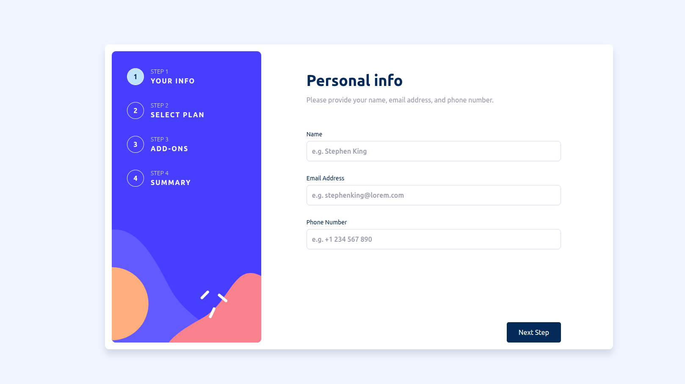

# Multi-Step Form

A modern, responsive multi-step form application built with HTML, CSS, and JavaScript. This project provides a seamless user experience for collecting information across multiple steps with form validation and dynamic navigation.

## Screenshot



## Features

- **Multi-Step Navigation**: Navigate through 4 distinct steps:
  1. Personal Info - Collect user's name, email, and phone number
  2. Select Plan - Choose between monthly or yearly billing with plan selection
  3. Add-ons - Select additional services and features
  4. Summary - Review all selections before confirmation

- **Form Validation**: Real-time validation with error messages for required fields
- **Responsive Design**: Works seamlessly on desktop and mobile devices
- **Dynamic Pricing**: Switch between monthly and yearly billing with updated pricing
- **Interactive UI**: Smooth transitions between steps with visual progress indicators
- **Summary Review**: Complete overview of selected plan, add-ons, and total cost

## Technologies Used

- HTML5
- CSS3
- JavaScript (Vanilla)
- Google Fonts (Ubuntu)

## Project Structure

```
multi-step-form-main/
├── images/          # SVG icons and images
├── index.html       # Main HTML structure
├── styles.css        # Styling and layout
├── multiform.js     # Form logic and interactivity
└── README.md        # Project documentation
```

## How to Use

1. Clone or download this repository
2. Open `index.html` in your web browser
3. Fill out the form step by step:
   - Enter your personal information
   - Select a plan and billing cycle
   - Choose any add-ons
   - Review your summary
   - Confirm your selection

## Getting Started

Simply open the `index.html` file in any modern web browser. No build process or additional dependencies are required.

---

Built as part of Frontend Mentor challenges.

